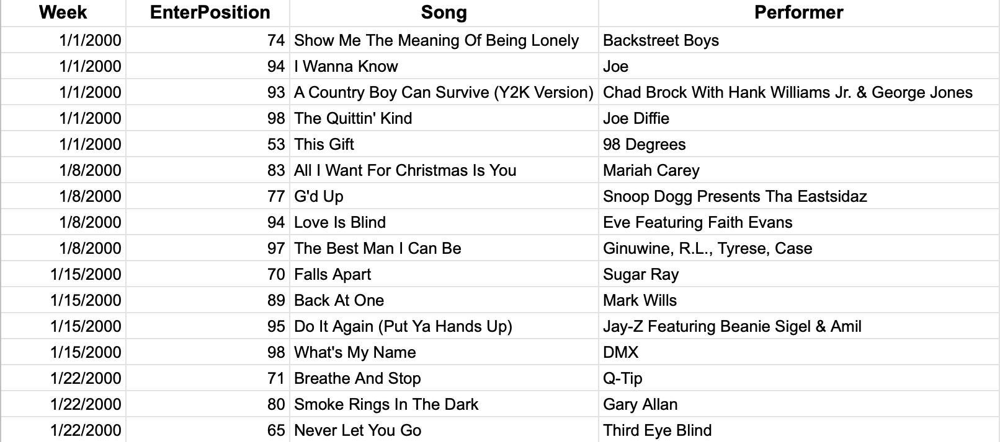
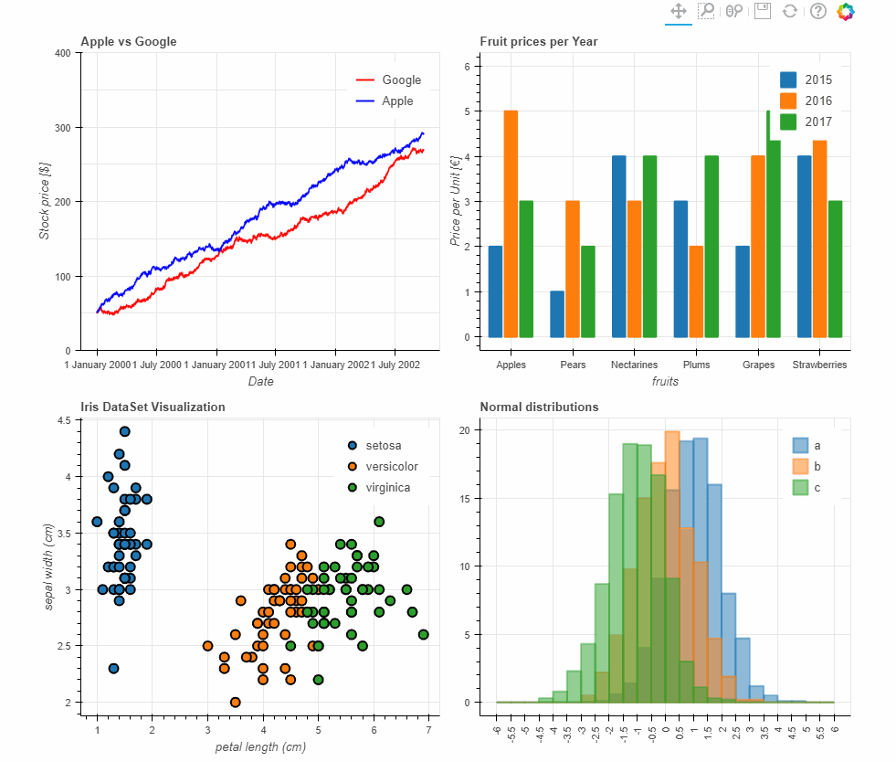
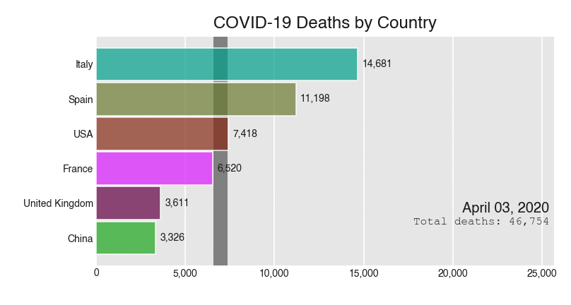

# Create a Race Bar in Python
Tutorial Prepared by: Joi Anderson ([@joicodes](https://github.com/joicodes)) • [View on Notion](https://www.notion.so/Create-a-Race-Bar-in-Python-6ad8b31aeb2849ebb5fcb27e0bdb1831) • Updated: Sept. 27, 2020

<br/>

### **Step 1: Curate a Data File 📊**
<br/>

**Finding an interesting data set:**

A **data set** is a collection of data. 

Data sets are created in many different ways. Some are based off of human observations or surveys, like the U.S. Census. Others may be machine-generated, like satellite forecast data.

The most common format for data sets is a spreadsheet or CSV. Let's aim to find a dataset that is formatted as a CSV. 

Here is a list of sources for interesting data sets to explore:

- [data.world](https://www.data.world/)
- [FiveThirtyEight](http://fivethirtyeight.com/)
- [Google Public Data Sets](https://cloud.google.com/bigquery/public-data/)
- [/r/datasets](https://www.reddit.com/r/datasets/top/?sort=top&t=all) (on Reddit)
- [DataSF](https://datasf.org/opendata/)

   For this workshop, we will be using:  [Hot 100 singles (1/1/2000 and 12/28/2019)](https://docs.google.com/spreadsheets/d/1w6qXo81agnHLPWsRSh3jOqe2LIZOw3fly7NNAySPrsw/copy)

<br/>

**Understanding Your Data:**

Before starting your analysis on the data set, let's take the time to first understand the data we are working with. So let's take a look at the data: 

<br/>




Observations:

- **About**: New Hot 100 singles from January 1, 2000 to December 28, 2019
- **Data Source**: Web scrapped from [Billboard.com](https://www.billboard.com/charts/hot-100)
- **Size**: 7,850 rows of data (i.e. 7,850 songs)
- The first row of my data contains column names.
- **Columns**:
    - `Week` -  The week the song entered the Billboard Hot 100
    - `EnterPosition` - The position the song entered the Billboard Hot 100
    - `Song` - Name of the song
    - `Performer` - Name of the performer and features on the song.

<br/>

**Download Data** 

Export the Google Sheets file as a CSV and move it to our repository:

```bash
File > Download > Comma Separated Values (.csv, current sheet)
```

Rename the file `hot100.csv` and add it to your repository. 


**👀 Here is how your data looks as a raw CSV file: [Preview](https://raw.githubusercontent.com/joicodes/Top-100-Racing-Bar-Chart/master/hot100.csv)**


<br/>

---

<br/>

### **Step 2: Using Pandas 🐼**

<br/>

**Meet Pandas (Python Data Analysis Library)**

`pandas` is a Python library that give you a set of tool to do data analysis. 
If want to work with big data sets, then `pandas` is going to be your best friend. 👯‍♀️



*Image from: [Python Awesome](https://pythonawesome.com/bokeh-plotting-backend-for-pandas-and-geopandas/)*

<br/>

To install `pandas`, in your Terminal write:

```bash
pip3 install pandas
```

<br/>

After it installs, we can import it into our `[main.py](http://main.py)` file:

```python
import pandas as pd
```

<br/>

**Loading our data from CSV file** 

<br/>

Now that we've imported `pandas`, we are ready to read the CSV file into Python using `read_csv()` from `pandas`:

```python
data_frame = pd.read_csv("hot100.csv")
```

<br/>

To see if it worked, we can see the first few rows of the data by adding the following to our code:

```python
print( data_frame.head() ) 
```

<br/>

`head()` gives us a snap shot of our data, by displaying  the first few rows and columns of the data set. 

You should an aggregated chart printed to the terminal like this: 

<br/>


We can also see the last rows of the data by using `tail()`

```python
print( data_frame.tail() )
```

<br/>
 


---


### **Step 3: Install Bar Chart Race 🏁**

<br/>

**Meet Bar Chart Race** 

<br/>

`bar_chart_race` is an open source Python library that can be used to create animated bar and line chart races in Python. It's is built on top of two popular Python data analytics library: `matplotlib` and `plotly`. This library simplifies creating racing graph animation!

<br/>

👉🏽  See [repo](https://github.com/dexplo/bar_chart_race)

<br/>



To install `bar_chart_race`, in your Terminal write:

```bash
pip3 install bar_chart_race
```

<br/>

After it installs, we can import it into our `[main.py](http://main.py)` file:

```python
import bar_chart_race as bcr
```

<br/>

**Install Dependency**

```python
brew install ffmpeg
```

<br/>

If you decide that you want to create a gif animation, install **Image Magick** and **Ghost Script**

```jsx
brew install imagemagick
brew install ghostscript
```


---

<br/>

### **Step 4: Prepare Data for Bar Chart 🔧**

<br/>

**Transform data into 'wide' data** 

<br/>

In order to create a racing bar chart, our data set must be in '**wide**' form where:

- Each row represents a single period of time
- Each column holds the value for a particular category
- The index contains the time component


<br/>


To transform our data set into **wide** form we would need:

- The index would be the week — using `Week`
- Each column has a name an artists who had a Top 100 hit — using `Performer`
- Each row should represent the cumulative count of songs by that week.


<br/>


Here a rough sketch of how it would look :

<br/>


We can transform  to be '**wide'** by creating a pivot table with `pandas`:

```python
wide_data = data_frame.pivot_table(index='Week', columns='Performer', aggfunc='count', fill_value=0).cumsum()
```

<br/>


Here is what `wide_data.head()` will print:
<br/>


**If you want to see the full output, check it out [here](https://raw.githubusercontent.com/joicodes/Top-100-Racing-Bar-Chart/master/wide_data.csv).**

<br/>

**Remove header**

<br/>

The pivot table generated a header for us that is not useful to us.

We can remove this header by using `drop level()` :

```python
wide_data.columns = wide_data.columns.droplevel(0)
```

<br/>

**Remove duplicate columns**

If you look at the results, there are some duplicated columns:

```python
wide_data = wide_data.loc[:,~wide_data.columns.duplicated()] 
```

<br/>

**Create a subset**

There are hundreds of artists with Billboard Hot 100 hits. Our graph would be wayyyy too big if we decided to make all artists race. Let's shorten our table to 5 columns to compare.

Rather than deleting the columns we are currently not using, we can create a subset with the columns we need with `pandas`:

Let's choose **5 Performers** (i.e. 5 columns of data) to race and store them in a list:

<br/>

```python
columns = [ "Mariah Carey", "Michael Jackson", "Drake", "Rihanna", "Lady Gaga"]
```

<br/>

Using that list of column names, we can create a sub-dataset by doing the following:

```python
sub_dataset = data_frame[columns]
```

<br/>

Let's print the first few rows of `sub_dataset` to what data it contains:

```python
print(sub_dataset.head())
```

<br/>


Now that we have our data ready... let the games begin!

---

### **Step 5: Create Your Animation 🏁**

<br/>

**Create .mp4 with Racing Bar Chart Animation**

```jsx
bcr.bar_chart_race(sub_dataset, filename='hot100.mp4')
```

<br/>

**Check out your video** 

Once your program has finished, check your repo for `hot100.mp4` and watch your 5 artists race!

Which artists did you choose? Were you surprised about who won?

Here is mine (watch in 5x speed):

[https://youtu.be/mgFmybMTnXs](https://youtu.be/mgFmybMTnXs)


**Check the [docs](https://www.dexplo.org/bar_chart_race/) for Bar Chart Race to customize your animation!**
